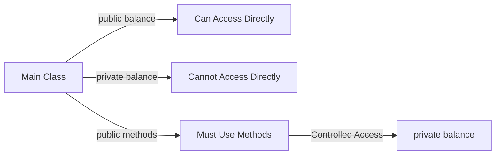
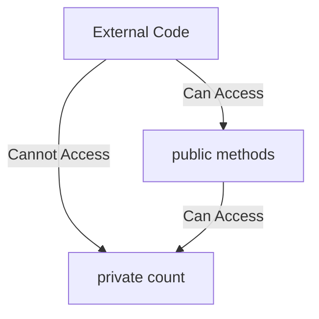
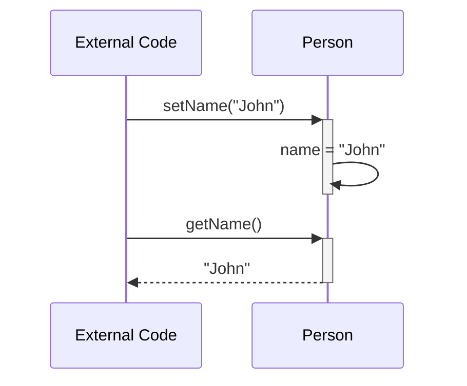
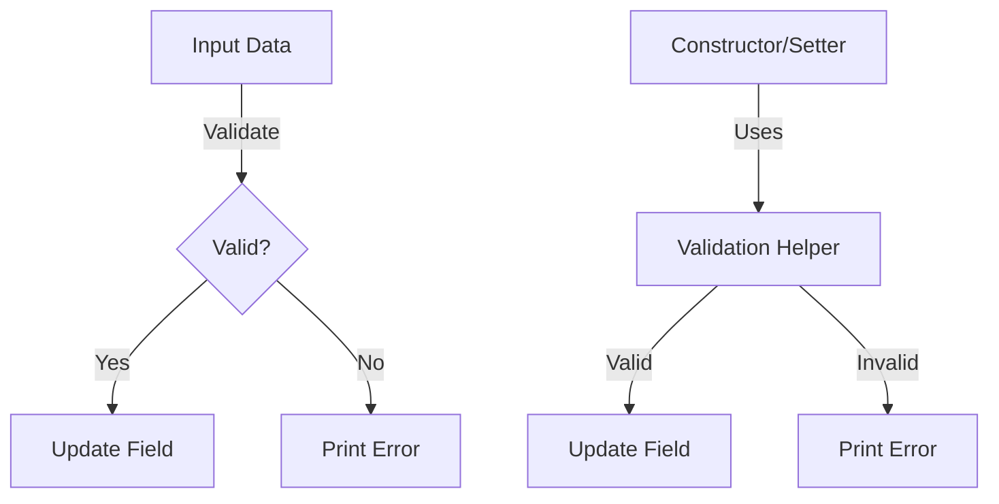

# Java Encapsulation Lab

## Table of Contents
1. [Access Modifiers](#0-access-modifiers)
2. [Data Hiding](#1-data-hiding)
3. [Getters and Setters](#2-getters-and-setters)
4. [Data Validation](#3-data-validation)

## Lab Setup
1. Create a package called `ie.atu.encapsulation`
2. Create a `Main` class inside this package
3. Create a `main` method inside this Main class
4. Place all the below classes from the DIY sections into this package. 

## 1. Access Modifiers

### Learning Objective
Understand how access modifiers control visibility of class members and see firsthand how the `public` and `private` keywords affect what you can access from outside a class.

### Explanation
Access modifiers are keywords that set the accessibility level of classes, methods, and fields. The two most common access modifiers are:
- **public**: The member is accessible from anywhere in your program
- **private**: The member is only accessible within the same class

When you use the dot operator (`.`) on an object in VS Code, IntelliSense shows you all the members you can access. This is a powerful visual demonstration of encapsulation in action - when you make a field private, it literally disappears from the list of accessible members.

### Example: The Problem with Public Fields
```java
public class BankAccount {
    public double balance;  // Public - accessible from anywhere!
    
    public BankAccount(double initialBalance) {
        balance = initialBalance;
    }
}
```

### What Can Go Wrong?
When fields are public, anyone can modify them directly, potentially breaking business rules:

```java
public class Main {
    public static void main(String[] args) {
        BankAccount account = new BankAccount(1000.00);
        
        // This should NOT be allowed, but it is!
        account.balance = -500.00;  // Negative balance!
        account.balance = 999999.99;  // Unlimited money!
        
        System.out.println("Balance: " + account.balance);
    }
}
```

### The Solution: Private Fields
```java
public class BankAccount {
    private double balance;  // Private - only accessible within this class
    
    public BankAccount(double initialBalance) {
        balance = initialBalance;
    }
    
    public void deposit(double amount) {
        if (amount > 0) {
            balance += amount;
        }
    }
    
    public double getBalance() {
        return balance;
    }
}
```

### Visual Representation


### DIY Exercise: Access Modifier Demonstration

**Part 1: Public Field Problems**
1. Create a `Student` class with the following **public** fields:
   - `name` (String)
   - `studentId` (int)
   - `gpa` (double)

2. Add a constructor that accepts all three parameters

3. In your `Main` class:
   - Create a `Student` object
   - Type `student.` and observe the autocomplete list in VS Code
   - Notice that all fields appear in the list
   - Set invalid values directly:
     ```java
     student.studentId = -1;  // Invalid ID
     student.gpa = 5.5;        // GPA above 4.0
     ```

**Part 2: Fixing with Private Fields**
1. Change all fields in the `Student` class to **private**
2. Add getter methods for all fields
3. Add a setter for `gpa` that validates the value is between 0.0 and 4.0

4. In your `Main` class:
   - Type `student.` again and observe the autocomplete list
   - Notice the fields are now gone from the list!
   - Try to access `student.name` directly - you'll get a compilation error
   - Use the getter method instead: `student.getName()`

**Expected Observation:**
When you type `student.` in VS Code:
- **With public fields**: You see `name`, `studentId`, `gpa`, constructor, etc.
- **With private fields**: You only see `getName()`, `getStudentId()`, `getGpa()`, `setGpa()`, etc.

The private fields have "disappeared" from outside access!

### Key Takeaway
The disappearance of private members from the autocomplete list is not just a convenience feature - it's the IDE enforcing Java's encapsulation rules. If you can't see it in the list, you can't access it directly. This is encapsulation protecting your data.

## 2. Data Hiding

### Learning Objective
Learn how to hide data using private access modifiers and understand why it's important for building robust applications.

### Explanation
Data hiding is the fundamental concept of encapsulation where we restrict direct access to certain components of an object, typically by making fields private. This protection prevents unauthorized access to internal data and helps maintain the object's state consistency. By controlling access to our object's data, we can ensure that the object's state is always valid and can't be corrupted by external code.

### Example
```java
public class Counter {
    private int count; // Private field - cannot be accessed directly from outside
    
    public void increment() {
        count++;
    }
    
    public void displayCount() {
        System.out.println("Current count: " + count);
    }
}
```

### Visual Representation


### DIY Exercise: Secret Message
Create a `SecretMessage` class that:  
- Has a private String field to store a message. 
- Has a public method to display the message
- Create a `Secret Message` object in the `Main` class
- Try and call the message field directly using the dot operator
- Print the message to the console using the public method

## 3. Getters and Setters

### Learning Objective
Learn how to provide controlled access to private fields using getter and setter methods.

### Explanation
While private fields prevent direct access, we often need controlled ways to read and modify their values through getter and setter methods. Getter methods allow read access to private fields while maintaining encapsulation, and setter methods provide a way to modify private fields with proper validation. This approach gives us the flexibility to change how we store and validate data without affecting code that uses our class.

### Example
```java
public class Person {
    private String name;
    
    // Getter method
    public String getName() {
        return name;
    }
    
    // Setter method
    public void setName(String name) {
        this.name = name;
    }
}
```

### Visual Representation


### DIY Exercise: Temperature Converter
Create a `Temperature` class that:
- Stores a temperature in a private double instance variable named `celsius`
- Provides a getter methods for `celsius`
- Provides a setter method that accepts celsius values

## 4. Data Validation

### Learning Objective
Understand how to validate data both in setter methods and constructors, and how to reuse validation logic effectively with helper methods.

### Explanation
Validation ensures that the data inside an object remains correct and meaningful. When encapsulating data, validation can occur in different stages of an object's lifecycle:
 - **Constructor** validation ensures that objects are created in a valid state from the beginning.
 - **Setter** validation ensures only valid data is stored when fields are modified after object creation.

### Example 1: Validation logic in a construcor and setter. Duplication of code. 
```java
public class Student {
    private int age;

    // Constructor with validation logic
    public Student(int age) {
        if (age < 16 || age > 100) {
            System.out.println("Invalid age: must be between 16 and 100");
            return;
        }
        this.age = age;
    }

    // Setter with validation logic
    public void setAge(int age) {
        if (age < 16 || age > 100) {
            System.out.println("Invalid age: must be between 16 and 100");
            return;
        }
        this.age = age;
    }
    
    public int getAge() {
        return age;
    }
} 
```

### Example 2: Using Validation Helpers

Using helper methods avoids duplication of validation logic between constructors and setters, improving maintainability and reducing bugs.  

```java
public class Student {
    private int age;

    /* Constructor is a kind of setter too. It initially sets the value of object fields. It too
       can use the same validation as the setter method */  
    public Student(int age) {
        this.age = validateAge(age);
    }
    
    public void setAge(int age) {
        this.age = validateAge(age);
    }

    // Private internal validation method just usable in this class by the constructor and the setter  
    private int validateAge(int age) {
        if (age < 16 || age > 100) {
            System.out.println("Invalid age: must be between 16 and 100");
            return 0;
        }
        return age;
    }
    
    public int getAge() {
        return age;
    }
}
```

### Visual Representation


### DIY Exercise: Grade Book
Create a `Grade` class that:
1. Has these private fields:
   - studentName (String)
   - numericGrade (int)
   - courseCode (String)

2. Implements these validation helper methods:
   - validateStudentName(String name) - Validates that student name is not empty
   - validateGrade(int grade) - Validates that grades are within range (0-100)
   - validateCourseCode(String code) - Validates that course code matches pattern (e.g., "CS101")

3. Uses the helpers in both:
   - Constructor
   - Setter methods

Example structure:
```java
public class Grade {
    private String studentName;
    private int numericGrade;
    private String courseCode;

    // TODO: Add constructor

    // TODO: Add getters and setters

    // TODO: Add validation helper methods

}
```

## Summary
This lab covered the essential concepts of encapsulation in Java:
1. Access modifiers and their effect on visibility
2. Data hiding using private fields
3. Controlled access through getters and setters
4. Data validation for maintaining integrity

## Further Reading
- Java Documentation: [Access Control](https://docs.oracle.com/javase/tutorial/java/javaOO/accesscontrol.html)
- Book: Effective Java by Joshua Bloch
- Book: Clean Code by Robert C. Martin
